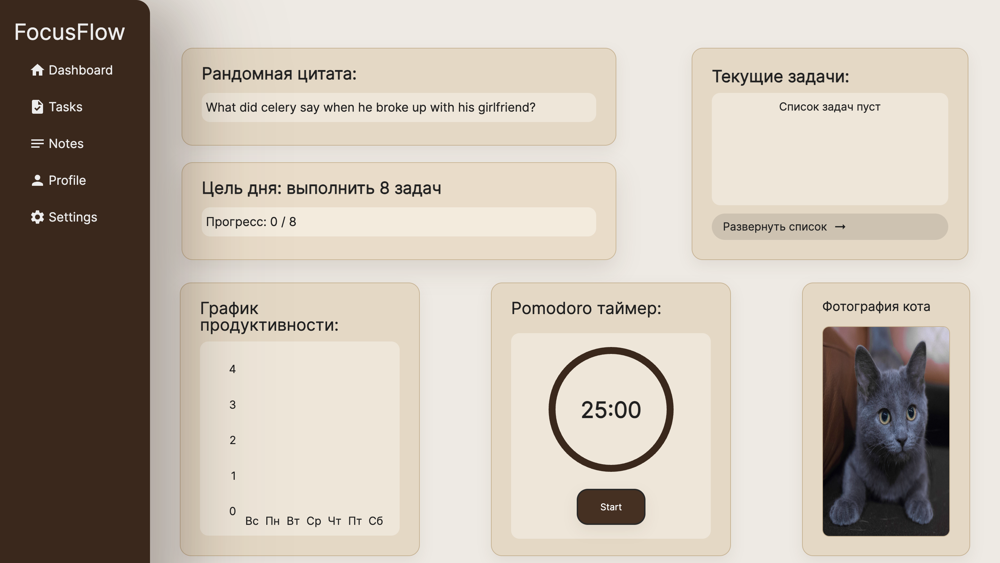
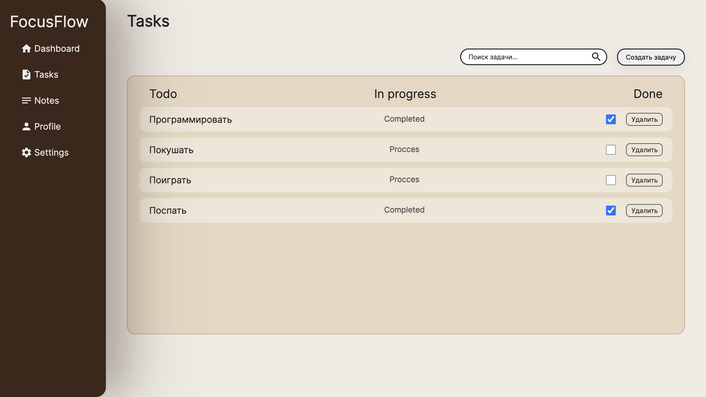
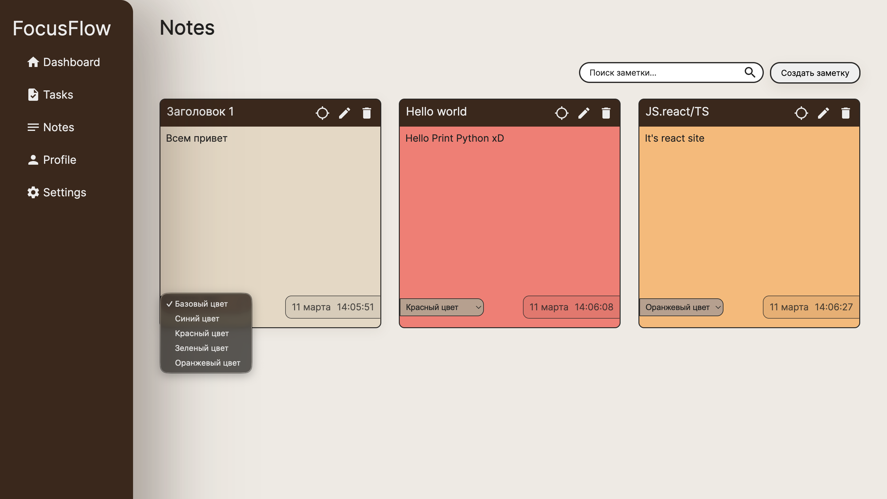
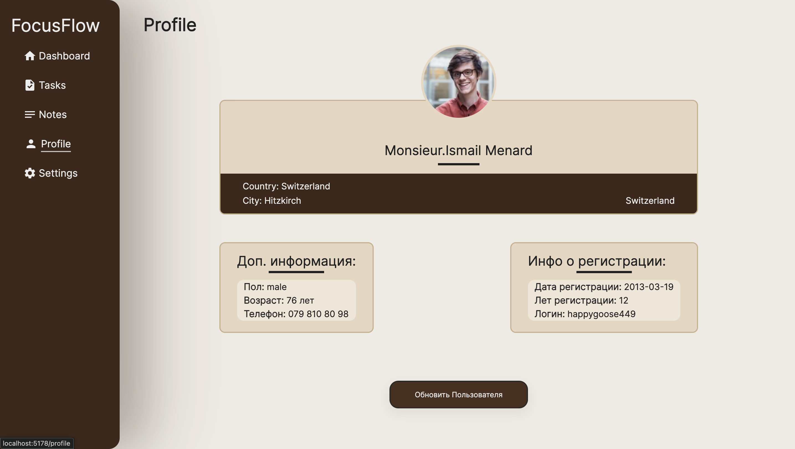
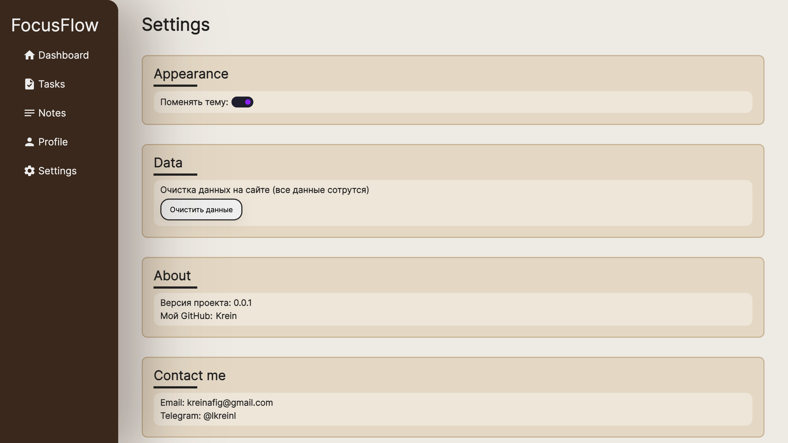
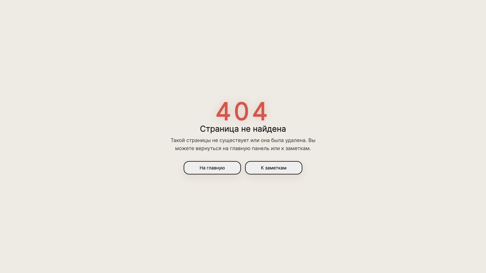

# 🚀 FocusFlow

FocusFlow — это современный **productivity dashboard**, созданный для управления задачами, фокусом и личной продуктивностью.

Приложение объединяет **Pomodoro-таймер, систему задач, заметки, аналитику и дополнительные инструменты** в одном интерфейсе, помогая пользователю организовать рабочий процесс и поддерживать концентрацию.

Проект создан как **pet-project frontend-разработчика** для демонстрации навыков построения современных React-приложений.


# ✨ Features

### 📊 Dashboard продуктивности
Главная страница отображает статистику активности пользователя:
- количество выполненных задач
- графики продуктивности
- ежедневную цель
- дополнительные виджеты для мотивации

### ⏱ Pomodoro таймер
Инструмент для концентрации по технике Pomodoro:
- круговой анимированный прогресс
- отображение оставшегося времени
- управление таймером (старт / пауза / сброс)

### 📋 Управление задачами
Полноценный Todo-лист:
- добавление задач
- отметка выполненных задач
- удаление задач
- сохранение состояния через LocalStorage

### 📝 Заметки
Раздел для хранения быстрых идей и записей:
- создание заметок
- удаление заметок
- простой интерфейс для быстрого ввода

### 📈 Графики активности
Визуализация продуктивности с использованием **Recharts**:
- отображение выполненных задач
- наглядная статистика активности

### 💬 Мотивационные цитаты
Получение случайных цитат через API для повышения мотивации.

### 🐱 Случайная фотография кота
Развлекательный элемент интерфейса — генерация случайного изображения кота через API Random Cat.

### 🎲 Генерация случайного профиля
Интеграция с API случайных пользователей для демонстрации работы с внешними данными.

### 🎯 Цель дня
Пользователь может задать ежедневную цель для повышения продуктивности.

### 🌙 Переключение темы
Поддержка **Light / Dark mode** для удобства работы в разное время суток.

### 📱 Адаптивный дизайн
Интерфейс корректно работает на:
- desktop
- tablet
- mobile устройствах


# 📸 Screenshots

### Dashboard


### Tasks


### Notes


### Profile


### Settings


### Not Found Page



# 🛠 Tech Stack

### Core
- React
- TypeScript
- Vite

### State Management
- RTK Query

### Routing
- React Router

### Styling
- SCSS
- CSS Modules
- Responsive Design

### Charts
- Recharts

### Animations
- Framer Motion
- Css animation

### APIs
- Random Quote API
- Random User API
- Cat Image API

### Storage
- LocalStorage


# Project Structure

src
 ┣ components
 ┣ pages
 ┣ store
 ┣ hooks
 ┣ services
 ┣ utils
 ┗ styles


# 📦 Installation

```bash
git clone https://github.com/KreiNafig/FocusFlow.git

cd FocusFlow

npm install

npm run dev
```


# 👨‍💻 Author

Ruslan  
Frontend Developer

- GitHub: https://github.com/KreiNafig